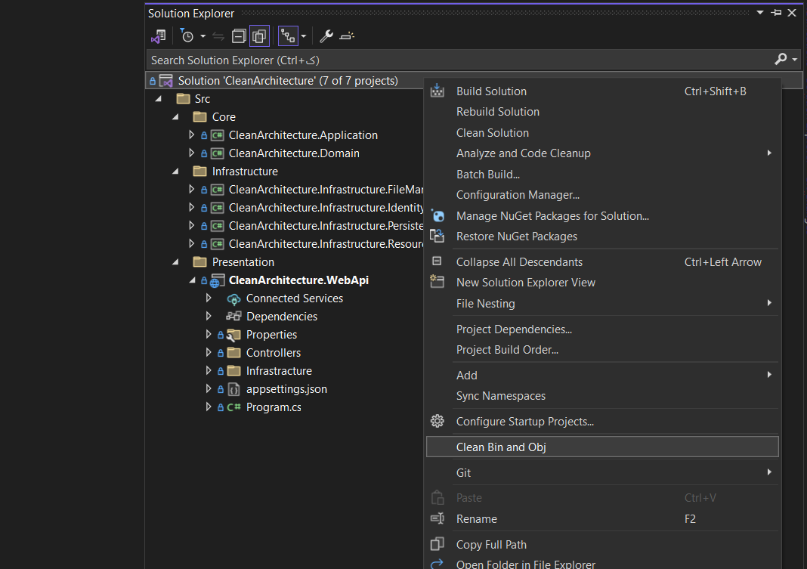

# Clean 'Bin' and 'Obj'

This extension is tailored for the Visual Studio development environment, enabling you to remove 'bin' and 'obj' folders from your projects with a simple click. This action eliminates executable files and project-related data typically stored in these folders, resulting in reduced project size. The extension provides developers with an effortless optimization solution, saving them time on project cleanup tasks.

# Getting Started
[Download the Extension](https://marketplace.visualstudio.com/items?itemName=SamanAzadi1996.CleanBinAndObj) and install it on your machine. Make sure Visual Studio 2022 is installed on your machine.

## How to Use

To use the extension, simply right-click on your project or solution in Visual Studio, then select "Clean Bin and Obj" from the context menu. The extension will automatically remove the 'bin' and 'obj' folders from the project.

# Note
Before using this extension, please ensure that the 'bin' and 'obj' folders are not mistakenly deleted and that your project compiles correctly.

# Features
1. One-click deletion of 'bin' and 'obj' folders
2. Reduction in project size and elimination of unnecessary space occupation
3. Compatibility with most .NET projects

# Give a Star ⭐️

If you find this extension useful, please consider giving it a star. Thank you!

# Share it!

Please share this Repository within your developer community, if you think that this would a difference! Thanks.

# About the Author

### Saman Azadi
- Twitter - [Saman Azadi](https://twitter.com/intent/follow?screen_name=saman_azadi_)
- Linkedin - [Saman Azadi](https://www.linkedin.com/in/saman-azadi/)
- Github - [Saman Azadi](https://github.com/samanazadi1996)
